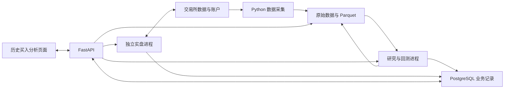

# USDT 量化项目构建 Implementation Plan

> **For agentic workers:** 使用 superpowers:executing-plans 按任务推进，以 `- [ ]` 跟踪完成情况。执行前同时阅读本计划、技术选型与研究文档。

**Goal:** 构建可通过 API 完成因子研究、回测和自动实盘管理的 USDT 市场中性量化项目。

**Architecture:** 一个代码仓库包含 Python 程序、FastAPI 接口和 `web/` 单页。研究、回测与实盘使用独立进程；策略复用 NautilusTrader 的订单、持仓、账户和事件处理。Parquet 保存批量数据与明细，PostgreSQL 保存实验、配置、任务和运行记录。

**Tech Stack:** Python 3.12、uv、Polars、NumPy、scikit-learn、NautilusTrader 2.x、Parquet、PostgreSQL、FastAPI、React、TypeScript、Vite、Linux、Docker Compose。

**Spec:** [技术栈选型](../specs/2026-09-16-usdt-quant-tech-stack-design.md)、[策略与因子研究](../../../usdt_quant_strategy_factor_research.md)。

## 当前起点与全局约束

任务 1 已验收；任务 2、3、5 的历史数据、共享回测和研究已实现，任务 4 的后端 API 与历史买入分析单页已实现。缺失数据与账户验证项仍按下文保留。任务 6 的原生复现确认 rc5 同 Venue 多执行客户端及现金现货/永续账户语义受限，任务 7 受阻。任务 8 已完成研究回测 API 的 Linux 容器构建与重启留存验证，网页由 Compose 提供于 5178 端口；交易验收仍受任务 6/7 限制。项目尚未达到八项全部完成。所有进度只在本计划内维护。

- 首版覆盖数据采集、因子研究、回测和自动实盘交易，通过 API 提交任务和查询结果。
- 交易范围沿用研究文档：Binance、OKX，BTC、ETH，各平台独立建立现货多头与等基础币数量的 USDT 本位线性永续空头组合。
- 因子公式、数据可用时间、标签、资金费、基差、费用和总投入资金收益率遵循研究文档。
- 项目实现所需因子和双腿策略逻辑；回测与实盘优先复用交易框架原生的订单、持仓和账户处理。
- FastAPI 接收操作并返回结果。研究回测与实盘分别在独立进程运行，耗时回测不能占用实盘事件循环。
- Parquet 保存批量分析数据，PostgreSQL 保存业务记录。交易框架的原生持久化方式随引擎版本适配结果确定。
- 研发使用 NautilusTrader 2.x。实盘等待 2.x 正式发布并通过本项目验收；当前候选发布版仅用于研发和验证。

## 实施前审查结论

复核日期：2026-09-16。引擎与费率字段证据见[技术选型第 4.3 节](../specs/2026-09-16-usdt-quant-tech-stack-design.md#43-2026-09-16-实施前复核)。已确认的技术栈和八项交付目标保持不变；以下修正直接落实在对应任务中。

| 发现 | 对实施的影响 | 对应修正 |
| --- | --- | --- |
| P1：rc5 的 OKX 历史解析取 `fundingRate`，未取实际结算字段 `realizedRate` | 直接使用原生历史值可能改变现金流与训练标签 | 任务 2 从原始历史记录的 `realizedRate` 导入，并用两个字段不相等的样本检查 |
| P1：把资金费按晚到的 `available_ts` 回放会触发 `Late funding boundary` | 单纯把全部数据的回放时间改成可用时间不可行 | 任务 3 在实际边界结算，策略特征独立遵守可用时间；检查结算后、信息可用前的决策 |
| P2：原双腿检查只核对总余额、成交次数和费用合计 | 两个账户的相反误差可能相互抵消 | 任务 1 分别断言每腿余额及四笔成交的方向、数量、价格和费用 |
| P2：B1 与分钟数据回放尚未写明决策和成交时序 | 不同实现可能得到不同基准，或在看见收盘价后回填同一根 K 线成交 | 任务 3 登记 B1 的窗口、决策间隔、期限和成本口径，并检验订单只能使用之后可成交的记录 |

盘口维护继续使用原生适配器；本项目仅保存研究要求的原始记录与质量结果。上述费率差异在已有 `data.py` 导入中处理，不新增交易所封装层或资金费结算引擎。

## 代码如何组织

以下是完成目标所需的文件职责，按对应任务创建；当前不预建空目录和占位代码。

| 文件或目录 | 职责 | 首次涉及任务 |
| --- | --- | --- |
| `pyproject.toml`、`uv.lock` | Python 依赖和可复现环境 | 1 |
| `checks/nautilus_v2.py` | 原生引擎的离线账户与成交检查 | 1 |
| `src/usdt_quant/data.py` | 历史导入、前向采集及覆盖报告 | 2 |
| `src/usdt_quant/strategy.py` | 两腿交易规则，供回测和实盘共同使用 | 3 |
| `src/usdt_quant/backtest.py` | 将可用历史数据交给原生引擎，生成回测报告 | 3 |
| `src/usdt_quant/api.py` | 任务查询与操作入口 | 4 |
| `web/`、`checks/frontend_api.mjs` | 历史买入分析单页与前端 API 检查 | 4 |
| `src/usdt_quant/records.py`、`sql/001_initial.sql` | PostgreSQL 业务记录读写及首次建表 | 4 |
| `src/usdt_quant/runs.py` | 启动独立研究、回测、交易进程，记录运行结果 | 4 |
| `src/usdt_quant/research.py` | 因子、标签、时间切分、模型评估和实验结果 | 5 |
| `src/usdt_quant/live.py` | 配置原生交易节点，接入实时行情、交易与账户事件 | 7 |
| `checks/data.py`、`checks/backtest.py`、`checks/research.py`、`checks/runs.py`、`checks/execution.py` | 数据、核算、研究、运行控制与执行异常的最小检查 | 对应任务 |
| `Dockerfile`、`compose.yaml`、`README.md` | Linux 部署、启动及复现说明 | 8 |

Python 包的 `__init__.py` 随首次使用创建。原始数据、Parquet 结果和模型文件保存在数据目录，PostgreSQL 记录其位置和版本；不把批量行情存入任务记录。

## 程序如何连接

`strategy.py` 由回测和实盘共同使用。余额、成交和运行状态来自后端与原生交易事件。真实账户密钥通过交易程序的运行环境提供。

## 开发顺序与交付物

| 顺序 | 要完成的工作 | 用户可检查的交付物 | 依赖 |
| --- | --- | --- | --- |
| 1 | 固定环境并完成双腿账目检查 | 可复现的资金费、四笔费用、总资金损益结果 | 现有离线检查 |
| 2 | 采集可核验数据 | 两平台两标的的数据覆盖报告与实际样本 | 1 |
| 3 | 建立共享策略和基础回测 | B0/B1 回测、成交及现金流报告 | 1、2 |
| 4 | 接通任务 API 与历史买入分析页面 | 选择买入时间、查看真实任务与回放结果 | 2、3 |
| 5 | 接入因子研究与模型比较 | 通过 API 运行研究、对比实验与样本外结果 | 2、3、4 |
| 6 | 完成两腿执行和账户规则验证 | 部分成交、拒单、断线及保证金压力结果 | 2、3 |
| 7 | 接入自动交易管理接口 | 前向模拟运行、账户查看、策略启动停止 | 4、5、6 |
| 8 | 完成 Linux 部署与全流程验收 | 可部署的 API 与可复现验收记录 | 1–7 |

前向数据采集从任务 2 开始持续积累。API 从任务 4 开始接真实结果，后续任务继续增加研究和实盘能力。任务 8 的真实资金验收还依赖 NautilusTrader 2.x 正式版及实际账户配置。

### 任务 1：环境与双腿现金流

**文件：** `pyproject.toml`、`uv.lock`、`checks/nautilus_v2.py`。

**输入与输出：** 输入现有合成报价和结算事件；输出三种费率下的成交、费用、最终余额及总资金收益率。

- [x] 保留单腿检查，先加入双腿预期断言确认失败，再实现原生双腿开平仓检查。
- [x] 使用 Python 3.12 与 `uv.lock` 固定研发环境；新增依赖随实际功能加入。
- [x] 核对四次成交、两份账户余额、正负资金费和清空后的仓位，将实际证据写回技术选型；独立审查通过。

合成输入：现货和永续各投入 10,000 USDT；现货买入/卖出 0.1 BTC，价格为 50,000 / 50,100；永续卖出/买入 0.1 BTC，价格为 50,100 / 50,150。结算标记价为 50,000；两份原生模拟 Venue 只区分离线账本。四笔手续费分别为 5、5.01、0.9018、0.9027 USDT，来自测试品种费率。

| 结算费率 | 现货最终余额 | 永续最终余额 | 总余额（USDT） |
| --- | --- | --- | --- |
| 0 | 9,999.99 | 9,993.1955 | 19,993.1855 |
| 0.0001 | 9,999.99 | 9,993.6955 | 19,993.6855 |
| -0.0001 | 9,999.99 | 9,992.6955 | 19,992.6855 |

**验收：** 保留已通过的单腿检查；双腿正费率样本净损益为 `-6.3145 USDT`，全部投入 `20,000 USDT` 的收益率为 `-0.0315725%`。该结果仅验算账目，不代表真实策略收益。

**复现：** `uv run --locked python checks/nautilus_v2.py`。

### 任务 2：历史数据与前向采集

**文件：** `src/usdt_quant/data.py`、`checks/data.py`，修改 Python 依赖。

**实施情况：** 2026-09-16 已取得 Binance BTC/ETH 各两天基础样本，另取得 BTC 60 天的三类分钟线各 86,400 条和 180 条资金费。OKX 官方域名曾返回 HTTP 403，后续部分请求成功；每次请求原文及成功/阻塞覆盖均保留。OKX 结算标记价仍缺失。前向 OI 已取得，原生 WebSocket 试运行尚无事件，不能视为盘口可交易或断档恢复验收通过。

**输入与输出：** 输入平台、标的、数据类别和时间范围；输出研究文档第 5 节规定的数据字段，以及实际覆盖区间、来源、缺口、时间单位和规则生效区间。

- [ ] 逐项核对 Binance、OKX 的官方字段和当前 2.x 原生适配器；行情订阅和订单簿维护优先使用原生能力，历史下载只补充其未覆盖的入口。
- [ ] 先取得两平台 BTC/ETH 的合约元数据、现货/永续分钟价格、实际结算费率和必要标记价，保留原始记录并写入 Parquet。
- [x] OKX 结算记录明确取原始 `realizedRate`，保留 `fundingRate` 供核查；缺少实际费率或结算标记价的记录标明缺口。若只能取得近似标记价，单列估算口径，不能记作精确账务验证通过。
- [x] 按真实数据覆盖确定起点。历史导入保留下载时间与可用时间推断依据；将当时可见费率与实际结算费率分别保存。
- [ ] 同时开始前向记录盘口、成交、可见费率、OI、标记价/指数价和可取得的 USDT 外部报价；强平和平台规则信息注明数据完整性及生效时间。
- [ ] 在历史导入中完成结算去重、时间单位处理及质量标记，生成覆盖报告；前向盘口直接沿用原生断档恢复，保存其断档与恢复结果。

**最小检查：** OKX 样本设 `fundingRate="0.0001"`、`realizedRate="-0.0002"`，导入结算值必须为 `-0.0002`，缺失 `realizedRate` 不回退到预测值；同一结算重复输入只保留一次；结算间隔跨分页衔接，首条没有前序时不强填 8 小时；毫秒与微秒样本对应正确时间；晚到数据不能用于更早决策；盘口缺段不能成为可交易样本。运行 `uv run --locked python checks/data.py`。

**验收：** 每个平台、标的、字段都能追溯到实际样本和覆盖报告。基础历史与高频样本分别列明起点；缺少历史预测费率、盘口或 OI 的区间不会伪造补齐。

### 任务 3：共享策略与 B0/B1 回测

**文件：** `src/usdt_quant/strategy.py`、`src/usdt_quant/backtest.py`、`checks/backtest.py`。

**输入与输出：** 输入数据版本、平台、标的、资金、时间范围、持有期限、费用和执行假设；输出原生成交、持仓、账户现金流及研究文档第 11 节的策略报告。

**实施情况：** B0/B1 和 Ridge 输入的 M1 使用同一原生回测与成本路径；每次比较是测试区间内的一次持有周期。逐笔成交、资金费、净值、基差与残余敞口已落盘；Windows 检查和独立审查通过。实际交易所保证金/清算、独立美元锚、盘口成交能力仍未验证，报告逐项标明。

- [x] 在 NautilusTrader 原生策略内实现 B0 固定持有和 B1 历史费率基准，按合约乘数、数量步长换算两腿数量，记录舍入后敞口。
- [x] 首次运行前登记 B1 使用最近费率还是滚动中位数、观察窗口、决策间隔、持有期限、基差预测假设、往返成本和风险缓冲；开仓与继续持有分别使用研究文档第 3.1 节的损益比较。把这些值随结果保存，不能运行后择优改写基准。
- [x] 回放现货、永续和真实结算事件。普通行情按可用时间进入策略；最终资金费作为离线结算输入在实际结算时刻回放，以该时刻的持仓和标记价原生入账。策略的费率特征只从满足 `available_ts <= decision_ts` 的研究数据计算，不直接读取结算回放的费率回调或缓存。成交、手续费和资金费均使用原生处理，按实际扣费币种记录并估值。
- [ ] 汇总总投入资金净值、基差损益、资金费、费用、回撤、资金占用、残余敞口和保证金压力。存在出入金时采用研究文档规定的时间加权口径。
- [x] 对只有分钟价格的样本登记决策、订单到达和成交时序：仅用已收盘且可用的 K 线生成信号，成交取订单到达之后的价格记录并应用登记的成本假设，不能回填该信号 K 线的开高低收。有盘口的数据另做执行回放，报告中注明数据和假设。
- [x] 按同一资金、期限和成本配置运行 B0/B1，保存配置、数据版本与结果明细，供 API 调用。

**最小检查：** 非 1 乘数与舍入、非固定 8 小时结算、负资金费、真实成交价下不重复扣滑点；以收盘信号下单不能成交在此前价格记录；修改尚未可用的最终费率不能改变此前策略的费率特征，但在结算时持有的仓位仍获得正确资金费；净值变化必须与现金流及未实现损益一致。运行 `uv run --locked python checks/backtest.py`。

**验收：** 固定数据和参数可复现两项基准；能够逐笔解释损益。USDT 净值与美元净值分别报告，美元锚缺失的区间明确显示无法计算。不将粗粒度数据的成本假设描述成已验证成交能力。

### 任务 4：历史买入分析页面与 API 操作路径

**文件：** `api.py`、`records.py`、`runs.py`、`sql/001_initial.sql`、`checks/runs.py`、`web/`、`checks/frontend_api.mjs`。

**输入与输出：** 调用方只提交建仓判断时间；后端自动使用覆盖该时点的已登记数据、固定研究切分、资金和成本参数，返回是否触发建仓及随后 24 小时的历史回放。内部参数和数据版本随任务保存。

**实施情况：** React、TypeScript、Vite 单页已完成，唯一输入为历史买入日期和小时（北京时间）。M1 当时判断与 B0 随后 24 小时的模拟回放分开展示，结果及曲线来自真实 API；支持真实分析记录、深浅模式和手机布局。`npm --prefix web run build`、`node --experimental-transform-types checks/frontend_api.mjs` 已通过，真实浏览器提交成功及缺数据提示已验证。

- [x] 建立已确认用途的 PostgreSQL 记录：实验、策略配置、任务和运行。先写建表 SQL，再实现本次需要的读写；保存参数、依赖版本、数据版本及结果位置。
- [x] FastAPI 接通数据覆盖查询、回测提交和结果查询。研究/回测使用 Python 标准库启动独立进程，并记录退出结果和错误；耗时计算不放在请求处理函数中。
- [x] 完成加载、无数据、输入错误和运行失败的显示。任务不存在结果时说明实际原因，不填充演示收益。
- [x] 通过 HTTP 提交一次成功回测和一次会失败的任务，验证后续仍可查询已有记录。

**最小检查：** 启动任务后接口能够继续响应；进程失败显示真实失败原因；成功结果对应提交时的参数和数据版本。运行 `uv run --locked python checks/runs.py`。

**验收：** 调用方只提交建仓时间即可得到历史判断、未建仓原因和回放结果。数据版本、切分、资金与成本由程序选择并随任务保存。

### 任务 5：因子、标签与模型研究

**文件：** `src/usdt_quant/research.py`、`checks/research.py`；修改 `api.py`、`runs.py`、`records.py`。

**输入与输出：** 输入已登记的数据版本、因子集合、窗口、标签期限、切分和模型参数；输出因子字典、标签说明、所有实验记录、单因子报告和模型对照。

**实施情况：** F01–F12 语义已实现。最新 BTC 60 天数据中 F08/F09/F10/F11 有样本，F05/F12 因真实历史输入缺失保持空值；模型当前仅纳入训练覆盖率 ≥98% 的 F01/F02/F03/F04/F06/F07/F10。示例 M1 预测净收益约 -2.3213 USDT，B0 强制 24 小时回放净损益为 -2.69014786 USDT。`checks/research.py` 已通过。

- [x] 用 Polars/NumPy 实现 F01–F12 语义；每项记录公式、单位、窗口、缺失处理和最大输入可用时间，无真实历史输入时保持空值。
- [ ] 按研究文档第 6 节生成下一次结算、未来 24 小时和 7 天的资金费、完整净收益、反转及亏损标签；执行成本和保证金标签绑定可验证的回测路径。
- [x] 按时间切分样本，删除标签区间跨越验证/测试边界的训练样本，仅用已成熟标签训练。标准化、填补和模型拟合使用 scikit-learn 原生 Pipeline，参数只在训练数据拟合。
- [ ] 完成时间序列 IC、分组、时间块置信区间和子样本检验；以 B0/B1 为对照运行 Ridge 与 Logistic，保存预测误差、概率校准、样本外净值与尾部结果。
- [x] 对 F05、F08–F12 记录样本覆盖与缺失原因；预测费率和成本预测的训练输入采用时间顺序上的样本外值。
- [x] API 接入按建仓时间提交、分析记录和结果查询；数据区间、参数和模型检查随任务保存，模型与因子计算接入同一策略的回测输入。

**最小检查：** 修改决策之后的输入不能改变此前因子或预测；边界未成熟标签不能进入训练；改变测试期分布不能改变训练期预处理参数。运行 `uv run --locked python checks/research.py`，并通过 API 实际运行一次研究任务。

**验收：** 相同输入能够重现因子与模型结果，所有尝试均有登记。模型与基准采用相同资金、成本、期限和风险预算；没有稳定增量的因子或模型可以被淘汰，计划不预设其有效。

### 任务 6：两腿执行、账户模式与异常验证

**文件：** 修改 `strategy.py`、`backtest.py`，新增 `checks/execution.py`。

**验证结论：受阻。** `checks/execution.py` 在 Windows/Linux 均复现：同一 BINANCE 或 OKX Venue 无法注册两个原生执行客户端；单 MARGIN 账户的现货成交不形成现金 BTC 库存，CASH 账户拒绝永续。原生部分成交、另一腿拒单后残余持仓、停止后仍有持仓的事件已记录；后续对冲与实际保证金规则未验收。结果见 `data/execution/native_rc5.json` 和 `data/execution/linux_native_rc5.json`。

**输入与输出：** 输入实际账户模式、合约规则、资金配置和研究中待校准的限额；输出两平台的成交、资金费、保证金和异常处置证据。

- [ ] 分别核验 Binance、OKX 的现货与 USDT 线性永续在所选 2.x 版本上的接入方式、数量单位、账户模式和实际手续费档位/扣费币种；不把合成 Venue 当作真实账户结构。
- [ ] 按较弱一侧盘口容量控制分批数量，按每次实际成交数量对冲。接入原生部分成交、拒单和撤单事件。
- [ ] 实现研究文档已经规定的未对冲金额/持续时间上限、数据陈旧处理、负费率及基差风险减仓；参数显式记录，不把实验候选数值设为生产默认。
- [ ] 按实际保证金规则和标记价检查资金压力，核验抵押资产、资金调拨和现货浮盈能否支持永续账户；资金费与实际账单口径对照。
- [ ] 回放拒单、断线、滑点放大、负资金费、USDT 异常和提现受限场景；区分停止新开仓、取消失效报价和处理已有敞口。

**最小检查：** 一腿成交而另一腿拒绝时，数量、敞口与后续动作可核对；行情中断后不继续开仓；保证金不足不能依赖虚构的现货浮盈抵扣。运行 `uv run --locked python checks/execution.py`。

**验收：** 每项异常都能从原生订单、账户事件和策略动作解释。清算、ADL 或账户规则如缺少可靠数据，明确记录未验证范围，不能以开关存在代替验收通过。

### 任务 7：自动交易与实盘接口

**文件：** `src/usdt_quant/live.py`；修改 `strategy.py`、`api.py`、`runs.py`、`records.py`、`checks/runs.py`、`checks/execution.py`。

**实施情况：受阻，尚未创建实盘程序或接口。** 除任务 6 的账户/路由限制外，当前环境原生 Binance 现货与永续 WebSocket 均连接超时，交易节点未启动策略。日志位于 `data/execution_probe.log`；前向采集只有公共 OI，不能证明行情、订单、账户链路可用。

**输入与输出：** 输入已验证策略配置、账户配置和交易程序环境中的凭据；输出实时账户、两腿持仓、订单成交、资金费及运行记录。

- [ ] 配置 NautilusTrader 原生交易节点和平台客户端，复用回测中的因子计算与策略逻辑；接入行情、账户、成交和账单事件。
- [ ] 先在当前版本实际支持并已核验的前向模拟环境运行，核对数据质量、特征一致性和两腿执行。模拟环境不能证明的真实账单和保证金差异单独列明。
- [ ] 通过原生账户查询、订单/持仓核对和经验证的持久化配置完成启动及重启核对，再恢复策略操作；不根据业务记录假定账户没有仓位。
- [ ] API 接通策略配置、启动、停止和状态查询。停止操作进入已验证的策略停止处理，接口返回剩余订单和持仓；不能用杀进程或“进程退出”代替平仓结果。
- [ ] 同时运行研究/回测和交易程序，验证计算任务不会阻塞实时行情、订单与账户事件。

**最小检查：** 断开并恢复连接、带未结订单重启、停止时仍有持仓、研究任务运行期间收到成交事件；记录每次实际结果。扩展现有运行与执行检查，并通过 API 实际操作启动、停止及查询。

**验收：** API 返回的运行情况与真实程序、订单和账户一致；策略能连续自动处理已验证的行情与成交路径。正式版尚未满足条件时，此任务可以完成模拟联调，真实资金验收保持未通过。

### 任务 8：部署与全流程验收

**文件：** `Dockerfile`、`compose.yaml`、`README.md`；按需修改运行配置。

**输入与输出：** 输入锁定依赖、已通过检查的程序、数据目录和部署环境配置；输出 Linux 上可启动、可复现操作的项目。

**实施情况：研究回测 API 部署已验收，交易部分未验收。** Linux 容器通过 `nautilus_v2.py`、`data.py`、`backtest.py`、`research.py`、`runs.py` 和 `execution.py`（最后一项确认原生限制，不表示实盘通过）。HTTP 提交研究 `4c88cc67-e3f3-4c73-aa0f-5638d89df6ce` 与回测 `69c80da7-14b9-44d7-bd9b-ea1cacb0098a` 均成功，完整重启 Compose 后，两项任务及报告内容保持一致。

Windows Docker 构建时中文目录触发共享路径错误，本次将相同源码复制到临时 ASCII 目录构建镜像，再从原项目目录启动 Compose；数据仍挂载本项目 `data/`。Linux 容器 60 秒前向采集同样只有 1 条公共 OI、没有原生行情事件，见 `data/forward/binance_BTC_1789551258/coverage.json`。

- [ ] 将 Python 环境和 PostgreSQL 放入 Docker Compose；保留研究/回测与实盘进程隔离，挂载批量数据、业务数据库及原生交易持久化所需目录。
- [x] 写明依赖安装、数据取得、运行入口和环境变量；交易所凭据不进入源码或报告。
- [ ] 在 Linux 运行现有检查，通过 API 实际完成“查看数据 → 提交研究 → 查看比较 → 运行回测 → 查看前向交易 → 停止并核对账户”的操作。
- [ ] 重启部署后核对数据和业务记录仍存在，并验证交易程序按任务 7 的启动核对恢复；失败原因能从 API 和运行日志定位。
- [ ] 确定真实资金版本时重新核对 2.x 发布状态，在该正式版本重跑账户、交易与回测验收；按用户实际账户和明确配置的资金完成真实成交与资金费账单核对。

**复现：** `docker compose config` 验证配置，`docker compose build` 验证构建，随后实际启动并完成上述操作。配置检查和构建成功不等于交易验收通过。

**验收：** 技术选型文档第 5 节全部得到实际证据，包括两平台两标的、资金费入账、总资金收益、两腿执行、进程隔离及 API 管理。真实资金验收必须在正式版和实际账户条件满足后完成，不以候选版模拟结果替代。

## 完成判定

双腿现金流只是任务 1。项目完成要求任务 1–8 的交付物与验收全部完成，并由 API 串联研究、回测和自动实盘管理；文件创建或单项检查通过都不能单独代表项目完成。
