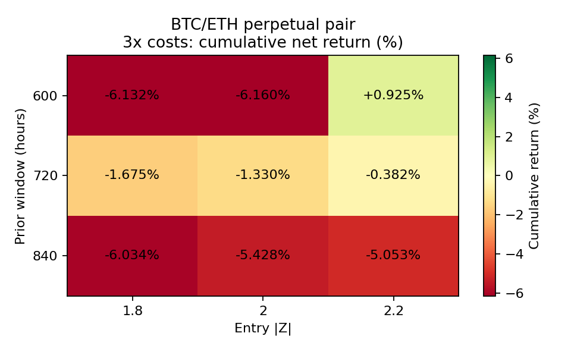
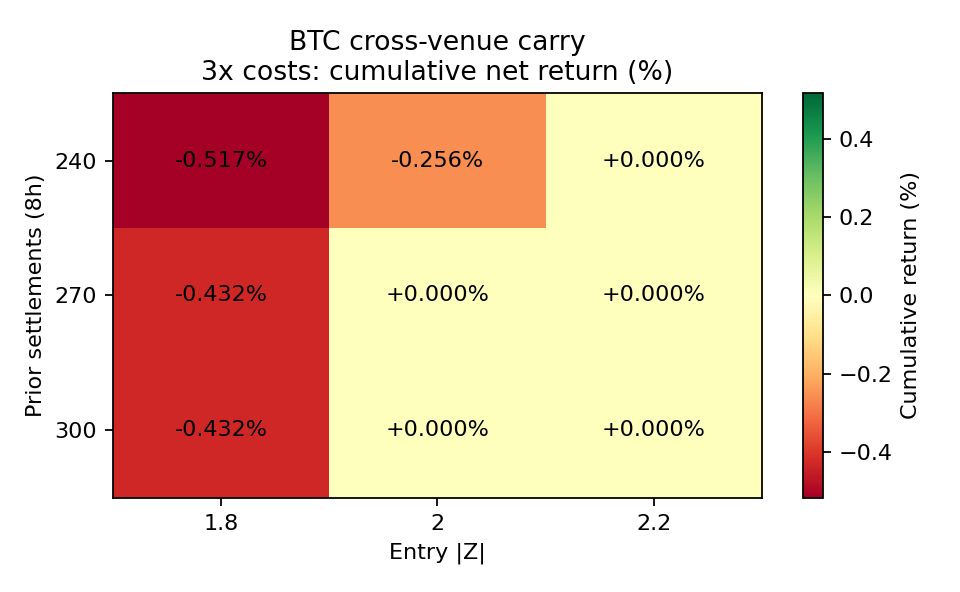

# BTC/ETH 研究轮次：2026-10-01 03:33 UTC

## 结果

**18 个候选、2 个同期持有基准完成真实回测并独立 finish，全部结果保留。0 个候选通过全部预设门槛。** 本轮补齐初始缺结果清单中的永续 OLS/ADF 配对、跨交易所资金费 Z 对冲两条；初始 16 条已有 **13 条实际结果**，剩余 B0/B1/M1 三条待补。真实评估得到零交易、零收益也保留为结果，不把它继续当成缺数据条目。

| 代表配置 | 1 倍成本净收益 | 2 倍 | 3 倍 | 3 倍整体回撤 | 1 倍正收益折 | 实际往返次数 | 结论 |
|---|---:|---:|---:|---:|---:|---:|---|
| 配对 600 小时、入场 Z=2.2 | +3.314% | +2.065% | +0.925% | 2.391% | 2/6 | 7 | 正收益孤立格点，逐折与邻域未通过 |
| 原配对 720 小时、Z=2 | +0.758% | -0.291% | -1.330% | 2.762% | 2/6 | 5 | 成本压力和稳健性未通过 |
| 配对 840 小时、Z=2 | -3.946% | -4.686% | -5.428% | 6.713% | 2/6 | 3 | 负收益，往返次数不足 |
| 原资金费对冲 270 个结算、Z=2 | 0% | 0% | 0% | 0% | 0/6 | 0 | 没有合格入场，不是正收益方法 |
| 资金费对冲 240 个结算、Z=1.8 | -0.167% | -0.342% | -0.517% | 0.517% | 0/6 | 6 | 资金费无法覆盖成本 |
| 资金费对冲 270 个结算、Z=1.8 | -0.141% | -0.286% | -0.432% | 0.432% | 0/6 | 5 | 成本后亏损 |

净收益是区间累计收益，不是年化；其他 12 个候选的三场景、全部交易和逐折指标见 [report.json](report.json)、[sensitivity.csv](sensitivity.csv)。2 个持有基准是比较对象，未做本轮双参数资格验证，登记为 rejected 不代表它们亏损：配对同期等初始资金持有 BTC/ETH 的三场景收益为 **4.340/4.065/3.792%**，对冲同期 BTC 全资金现货持有为 **15.902/15.580/15.259%**。后者持有的风险敞口明显高于对冲策略的本金/14 分仓，不能混称等风险比较。现金收益为零。

## 三项验证

### 时间滚动验证：实际完成

- 配对：2026-03-18 00:01 UTC 至 2026-09-02 00:01 UTC，滚动历史 180 日、3 日 embargo、测试 28 日、步长 28 日，共 6 折。估计窗口分别为 600/720/840 小时；每次 OLS 与 ADF 只看之前窗口，当前已完成小时收盘仅用于当前 Z 分子，随后 hh:01 分钟开盘成交。
- 资金费对冲：2026-03-29 01:01 UTC 至 2026-09-13 01:01 UTC，滚动历史 100 日、3 日 embargo、测试/步长 28 日，共 6 折。270 邻域的最大 300 次结算有足够暖机历史；当前已实现资金费经过一小时发布缓冲，下一分钟成交，不把已结算收益送给新开仓。
- 参数在计算前固定，没有监督标签、OOS 参数选择或未来标签，purge=0；滚动估计可使用当时已经可见的历史，包括之前已发生的测试期观测。相邻测试折连续持仓，边界没有人为清仓或重置本金。内部折边界用下一折交易前的参考价净值，最后边界计入终止平仓成本，逐折收益连乘与连续区间收益一致。
- 逐折收益、回撤、年化 Sharpe、Calmar 已保存。配对用小时净值、资金费对冲用八小时净值计算全区间回撤，未把最大单折回撤当整体回撤。单独保证金检查不能把这些采样曲线冒称分钟级最大回撤。

### 双参数敏感性：实际完成

配对交叉 `window_hours={600,720,840}` 与 `entry_z={1.8,2,2.2}`，其他固定 ADF p<0.05、BIC/maxlag=10、退出 |Z|<0.5、止损 |Z|>4。9 个配置中，1 倍成本 4 个正收益，三倍成本只有 **1/9** 为正，孤立正点在网格边缘，不能称稳定平台。资金费对冲交叉 `window_settlements={240,270,300}` 与 `entry_z={1.8,2,2.2}`，退出 Z≤0 或 OKX 不再优于 Binance，9 个配置三倍成本 **0/9** 为正：4 个有交易但亏损，5 个没有交易。

全部参数同时探索，未在 OOS 上择优后改阈值、时间窗口或失败判据。邻接格点 Sharpe 变化、完整收益范围、正 Sharpe 比例也在 report 中。没有用小而相关的网格声称多重试验校正后的显著性。





### 交易成本与约束：实际完成

每侧现货手续费 10bp、永续手续费 5bp、半价差 1bp、滑点 2bp；增加 `0.5 × 前20完整日波动率 × sqrt(订单金额 / 前20日平均日成交额)` 的冲击。所有成交量和波动率输入严格滞后，最大订单/滞后日 ADV 为 0.1%；OKX 使用真实 `vol_quote`，没有借用 Binance 成交量冒充 OKX 深度。两腿每次成交均计费，终止平仓也计费，配对按当前交易所快照的 lot/tick/min_notional 处理。

成本 1/2/3 倍同时放大手续费、价差、滑点、冲击；资金费使用实际有符号结算：**支出放大、收入不放大**，保留原始实际结算与压力增量。Binance 使用官方 fundingRate API 的实际费率和对应结算 markPrice，保留毫秒级结算偏移；OKX 使用真实已实现费率，按原脚本的结算前一分钟 close 作为标记价格代理，明确不是精确结算 mark。交易成本金额及本金占比、手续费与资金费分别保存；交易成本占比不含净资金费，资金费支出/收入可由逐事件账本核对。

无现货空头、无借币。配对永续的入场总名义金额不超过权益，账户以 pooled collateral 的合并 NAV 检查假设的 1% 维护保证金；小时标记价格高低点作保守检查，不进入提前成交或信号。对冲本金一半为 Binance 现货现金、一半为 OKX 永续抵押，无跨交易所转账；现货现金非负、永续每分钟价格高点下满足假设维护保证金。**本轮没有现金或维护保证金违例。** 当前元数据、维护比例与资金费发布缓冲均为声明的模拟假设，没有历史规则/盘口校准，不能由此声称安全实盘容量。

## 原规则补测与证据

两条原 spec 保持原指纹，均先 reserve 后计算。原脚本所定 **2026-03-16 至 2026-09-15** 留段，平坦成本下配对收益 **+2.767%**、32 次两腿成交；资金费对冲 **0%**、0 次成交。完整原输出在 [pairs_legacy_result.json](pairs_legacy_result.json)、[cross_legacy_result.json](cross_legacy_result.json)。原日期、成本与新的滚动区间不同，不能把结果差异全归于单一成本因素。新核算与两条原脚本的整段净值逐点核对，误差小于 1e-7 USDT。

本地配对脚本是明确的简化规则：没有作者仓库的额外 time-stop，历史 spread 用本次历史 OLS beta 构建，不能冒称完整复刻作者公开业绩。作者仓库访问时 main SHA=`2713e8a722aab5f2abb6c9adc804746669e1772a`；本地原规则代码 SHA256 和父提交版本均留档。

### 数据与本轮修复

- BTC/ETH 永续各 **525,600** 分钟、各 **1,095** 次真实资金费结算；小时标记各 **8,760** 条。108 个 Binance ZIP 与官方 CHECKSUM 一致，期货原始时间单位实测为毫秒，规范化纳秒；上一轮现货数据则为微秒来源，按各自实际单位解析。
- 官方标记归档各缺同一日的 24 小时，完整性检查先失败并停止。随后通过官方历史 markPriceKlines REST 取到缺失的真实 24 条，保存补取 URL、响应 SHA256 和时间戳，再校验完整性；没有邻值推算或零填充。见 [binance_data_manifest.json](binance_data_manifest.json) 和修复前诊断日志。
- OKX 有 **394,560** 连续分钟、**822** 次真实资金费，所有原始文件、规范化数据和成交量哈希保存。原下载器把 `7.019044316E-7` 与 `0.0000007019044316` 当不同字符串而失败；新增 Decimal 数值比较，真实费率、时间或币种变化仍拒绝。回归检查有先失败、后通过日志；原下载失败也保留。见 [okx_data_manifest.json](okx_data_manifest.json)、[checks/okx_funding_rows.py](../../../checks/okx_funding_rows.py)。
- 所有原始 ZIP、分钟线和较大数据只缓存于忽略的 data/；Git 保存代码、哈希、轻量完整收益证据和图表。
- NumPy 折数比较产生 NumPy bool，首次汇总写 JSON 失败。18 个候选的 54 条净值已存入检查点，修复计数为原生 int 后恢复，候选没有重算或调参；两个比较对象作为本轮仍在执行的配置完成复核。失败、恢复和后续从原始输入审计重放日志都保存。

## 登记、判据与局限

20 个具体配置（含 2 个比较基准）全部 **事先 reserve**，每个实际成本场景、具体参数、交易、资金费和连续净值保留；最终逐个 finish 为有实际结果的 rejected。候选门槛固定为：1/2/3 倍都正收益，至少 4/6 个正收益测试折，三倍成本整体回撤≤25%，邻域三倍成本正收益比例≥60%，至少 4 次往返，无现金/维护保证金违例。两条原配置与 16 个新参数候选加两条新比较定义，本轮新增 18 个定义，累计 **72 个去重后的具体定义**；真正既往全部试验数未知，旧组合 ID 别名继续保留。

本轮没有合格新方法。600 小时/Z=2.2 的配对仅保留为正收益线索，当前配置正式 rejected，不因盈利格点重写失败门槛；它需要不同、未使用的数据才能独立确认。该段历史已被使用，属于开发验证。盘口、历史交易所规则、USDT 脱锚、托管/跨交易所故障、真实清算规则/费用尚未充分建模；不能称稳定实盘盈利。

下一轮优先补 B0/B1/M1。已有真实 spot/perp、资金费及结算标记缓存可复用，但原生 Nautilus 依赖、分钟 mark 数据及各次持有/模型配置还需完整准备和登记。不会把工程检查当回测，也不会精确重复本轮完成的参数网格。

## 检查与复现

```bash
.venv/bin/python checks/okx_funding_rows.py
.venv/bin/python research/experiments/20261001T033355Z/check_accounting.py
.venv/bin/python research/experiments/20261001T033355Z/check_evidence.py
python3 checks/strategy_registry.py
OPENBLAS_NUM_THREADS=1 OMP_NUM_THREADS=1 .venv/bin/python research/experiments/20261001T033355Z/evaluate.py --reproduce
```

最后一条是明确的归档审计重放：使用已完成 spec、断言所有净值与归档完全一致，输出到忽略的 data/runs，不追加新实验或改报告。已实际检查 **54 条候选 + 6 条比较成本曲线逐点一致**。登记报告 SHA256、20 次 reserve/finish、六折收益连乘、OLS 只用既往数据、资金费先结算后入场、滞后成本、真实数据源哈希均已核对。没有遗留 reserved。

原研究依据：[作者配对仓库](https://github.com/Bauch0430/crypto-pairs-trading-btc-eth)、[资金费对冲原研究](https://khanh1ng.github.io/writing/2026/cross-exchange-funding-carry/)、[Binance 归档说明](https://github.com/binance/binance-public-data)、[Binance 资金费历史接口](https://developers.binance.com/docs/derivatives/usds-margined-futures/market-data/rest-api/Get-Funding-Rate-History)，访问日期 2026-10-01。
