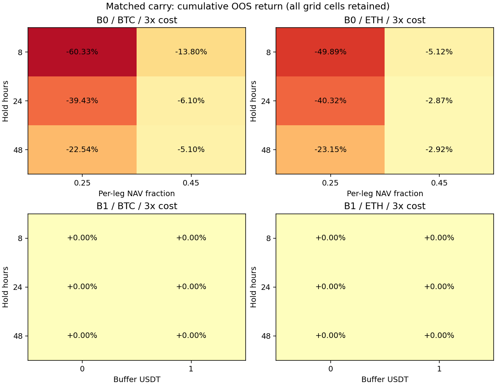

# BTC/ETH 研究轮次：2026-10-01 05:34 UTC

## 结果

**24 个连续候选、8 个原生单次案例、2 个持有基准完成真实计算，共 102 个成本场景。0 个连续候选通过全部预设门槛。** 2 个初始聚合工程条目与上述具体案例关联，共 36 个登记记录逐一 finish；初始 16 条现在有 **15 条实际证据**，剩余 M1 Ridge 待补。初始 B0/B1 登记是简写的多币种示例范围，补上真实案例不等于该范围已经完整通过长期稳健性验证。

- B0：12 个连续配置在 1/2/3 倍成本全部亏损；每个币种的六格邻域都没有正收益平台。
- B1：12 个连续配置均没有合格入场，0 交易、0 收益；零交易是实际评估结果，不再误称缺结果或正收益。
- 全部成功、负收益、零交易及环境/接口失败记录保留，没有在 OOS 看结果后改网格或失败门槛。

| 代表配置 | 1 倍净收益 | 2 倍 | 3 倍 | 3 倍整体回撤 | 往返 1x/3x | 现金不足拒绝 1x/3x |
|---|---:|---:|---:|---:|---:|---:|
| B0_BTC_h8_f0.25 | -37.019% | -60.266% | -60.333% | 60.333% | 448/298 | 0/1343 |
| B0_BTC_h48_f0.25 | -7.846% | -15.523% | -22.536% | 22.536% | 82/82 | 0/0 |
| B0_BTC_h48_f0.45 | -7.039% | -13.210% | -5.098% | 5.098% | 39/9 | 2074/3544 |
| B0_ETH_h24_f0.25 | -15.624% | -29.041% | -40.321% | 40.321% | 161/161 | 0/0 |
| B0_ETH_h24_f0.45 | -0.962% | -1.918% | -2.867% | 2.867% | 5/5 | 3884/3884 |
| B0_ETH_h48_f0.45 | -0.971% | -1.942% | -2.916% | 2.916% | 5/5 | 3740/3740 |
| B1 全部 12 格 | 0% | 0% | 0% | 0% | 0/0 | 0/0 |

收益为 168 日区间累计值，不是年化。上表展示代表格点，全部参数、逐折 Sharpe/Calmar、净收益、回撤、次数和成本见 [report.json](report.json)、[sensitivity.csv](sensitivity.csv)。两类候选的 1 倍正收益折数全部为 0/6。所有连续样本均未发生已执行订单的现金负余额或声明维护保证金违例。**现金不足拒绝是约束实际生效，不能把大量拒绝的路径当可无限重复交易。**

部分三倍成本结果亏损较少：独立账本不允许转账，损益留在不同账户；场景成本和净值变化影响下一笔可用现金与目标数量，导致开仓次数下降。例如 BTC 48h/45% 从 39 次减少至 9 次。成本场景不是强行固定交易次数的同一持仓路径，所以非单调总损益不是“成本增加改善收益”的证据。

## 三项验证

### 时间滚动：连续候选完成

区间 **2026-03-18 00:01 至 2026-09-02 00:01 UTC**，6 个连续 28 日测试折；每折有之前 180 日历史段和 3 日间隔。B0/B1 是预先固定的规则，没有监督标签或参数拟合，purge=0；运行中的资金费/流动性特征仅使用当时已经可见的过去观测，包括此前测试期已经发生的数据。没有随机分折、OOS 选参数或宣称该复用历史是未触碰最终测试集。

小时决策使用已结束的上一小时分钟收盘，下一 hh:01 分钟真实开盘价成交；数量按决策时已经结算的 NAV 和当时价格确定。实际结算在决策至成交之间发生时，先记入旧仓再成交，不把它送给新仓或用于提前确定数量。资金费信息需实际 settlement+1h 的 available_ts 后可用，保留原 API 的毫秒偏移。相邻折不重置本金或清仓；中间边界为下一折交易前参考价 NAV，末尾含真实终止成本，逐折连乘与整体收益一致。

连续净值采用每小时下一分钟的真实现货/永续开盘参考价，按独立账本核算，并非每分钟结算 mark 净值；整体回撤来自完整连续采样曲线，不能称分钟级最大回撤。保证金另外使用真实小时 mark high 的保守边界检查。

### 双参数敏感性：连续候选完成

- B0：每币种 `holding_hours={8,24,48}` × `per_leg_fraction={0.25,0.45}`，两币共 12 格。强制尝试入场、固定期限退出，退出之后下一个小时才可再入场。
- B1：每币种 `holding_hours={8,24,48}` × `buffer_usdt={0,1}`，固定 21 次已实现资金费的小时费率中位数、45% 单腿敞口，两币共 12 格。预计持有期资金费减去双腿预计往返成本须大于缓冲；持仓后只比较剩余资金费与将来的退出成本，不再扣已沉没的入场成本。
- 所有四个六格邻域在三倍成本下正收益比例均 0/6。B0 的相邻参数 Sharpe 差异、收益范围、多指标全部保存；B1 的零波动路径 Sharpe/Calmar 为空，不能填造正值。



### 交易成本和约束：连续候选完成

本金 10,000 USDT，现货现金和永续抵押各 5,000，无转账。fraction 表示每条腿的入场名义金额占当时总 NAV，25%/45% 意味着两腿总名义敞口约 50%/90%，没有归一化权重。共同最小 lot 下两腿同数量，无现货空头或借币。当前官方 spot/perp 元数据用于历史，是明确的模拟假设，快照与哈希保留。

每侧 spot 手续费 10bp、perp 5bp、半价差 1bp、滑点 2bp，加 `0.5 × 之前20完整日波动率 × sqrt(订单名义金额 / 之前20日平均日成交额)` 冲击；spot/perp 使用各自真实成交量，每笔参与率≤0.1%。实际 tick 向不利方向取整，入场和退出两腿都计成本。1/2/3 倍放大成交摩擦和支出资金费，资金费收入不放大；B1 预计成本保持基准 1x，压力用于实际结算，未因压力提高筛选门槛美化连续收益。

资金费是实际 Binance rate × 对应实际结算 mark × 当时开仓数量。现货现金不得负，永续抵押加未实现损益在真实小时 high 下检查 1% 名义金额维护比例；整个小时 envelope 可能包含入场之前的极端点，是保守检查，不影响信号。没有执行自动强平路径。实际历史清算阶梯、真实盘口、USD 锚、托管故障和手续费等级仍不完整，不能宣称安全实盘容量或稳定实盘盈利。

B0 一倍成本的毛损益/执行成本安全余量最高仅 **0.0433 倍**，低于技能所用 2.5 倍目标；其他格点更低或为负。最高估计订单/滞后日 ADV 为 **0.00000770**。这些是估计边界，没有实际 L2/TCA 校准。

## 原生补测范围和基准

原生 Nautilus **2.0.0rc5** 已安装，现有 `checks/backtest.py` 真实运行通过。原 B0/B1 引擎和规则文件没有修改；每类 BTC/ETH × 8/24h 的 4 个案例都独立预登记，使用 2026-03-18 至 03-21 的真实小时完成价格、完整历史资金费、精确结算 mark 和原平坦 5bp 执行成本。spot/perp 原费率分别 10bp/2bp，执行与支出资金费做 1/2/3 倍压力。压力后的原生现金结算保存，预测仍使用未放大的真实历史费率。

原生 B0 四案例 1 倍成本净收益在 **-0.197% 至 -0.185%**，B1 四案例全部不交易。每次原生账户与外部净值对账一致。原引擎使用下一条共享完成报价成交，本轮原生输入是小时报价，入场延迟一小时；已知固定期限在期限报价上直接退出。8h 案例实际持仓约 7h，期限之后几毫秒的结算不能计入已退出仓位。这与连续扩展下一分钟成交、约完整 H 小时持有不同，报告明确区分。

**原生 72h 恢复案例仅提供原引擎真实结果，使用原平坦执行成本，没有容量冲击或长区间双参数资格验证；本轮完整三项验证在另行预登记的连续扩展完成。** 原生单次案例及聚合初始条目均 rejected，不能据这些案例称长期稳定性已通过。

同期持有基准仅将初始资金 45% 投入各自 spot，余款现金零收益：
- benchmark_BTC: 1/2/3 倍收益 **2.044/1.922/1.800%**；三倍整体回撤 13.963%。
- benchmark_ETH: 1/2/3 倍收益 **1.864/1.740/1.617%**；三倍整体回撤 17.651%。

持有基准存在方向敞口，carry 净方向敞口接近零，不是等风险比较。基准的 rejected 指没有本轮双参数资格，并非收益一定为负。现金基准收益 0。

## 数据、登记、检查与复现

- BTC/ETH spot、perp 各 525,600 条连续真实分钟线；mark 各 8,760 小时；各 1,095 次实际资金费。复用上一轮已经下载的数据，162 个 ZIP 的官方 checksum 与文件 SHA256 本轮再次核对。之前 mark 归档真实缺失的 24h 已以官方 REST 真实补取，前轮 manifest 保留来源和响应哈希。
- [现货元数据 manifest](spot_metadata_manifest.json) 保存本轮官方单币种请求与冻结快照。最初多币种请求 HTTP400 真实失败留档，改为单币种成功，不猜测或填造规则。缓存大行情与原生临时输出不提交；完整结果以确定性 gzip JSON 保存于 results/，顶层报告含逐文件 SHA256。
- 所有 34 个具体配置和 2 个恢复范围在计算前逐次 `registry.py reserve` 成功；36 个都 finish 为有实际结果的 rejected，没有 pending。累计去重定义 **106**，历史实际尝试总数仍未知，不声称选择偏差校正后的显著性。
- `check_accounting.py` 在实现前失败、实现后通过；原生旧检查通过；独立组合现金流重建核对 **314,574 个小时净值点**，与原生账户资金费、数据/源码哈希、全部六折连乘一起通过。
- 归档审计从原输入重新计算 **102 个场景**，完整输出（含决定、成交、资金费和净值）逐项相同。明确的 audit 重放不新增研究配置、不写已登记报告、不用来再次搜索同一参数。

```bash
PYTHONPATH=src .venv/bin/python checks/backtest.py
.venv/bin/python research/experiments/20261001T053425Z/check_accounting.py
OPENBLAS_NUM_THREADS=1 OMP_NUM_THREADS=1 .venv/bin/python research/experiments/20261001T053425Z/check_evidence.py --finished
python3 checks/strategy_registry.py
OPENBLAS_NUM_THREADS=1 OMP_NUM_THREADS=1 .venv/bin/python research/experiments/20261001T053425Z/evaluate.py --reproduce
```

以上命令在研究 worktree 根目录执行，依赖同哈希缓存和报告中版本。恢复数据的源码与来源保留于前两轮 download 脚本/manifest；重放不会重新抓当前元数据替换已冻结快照。日志见 evaluate_stdout.log、reproduce_stdout.log、check_evidence_before_finish.log、check_evidence_after_finish.log 和 finish_stdout.log。

本轮门槛事前固定：三个成本场景都正收益，至少 4/6 正收益折，三倍成本回撤≤25%，参数邻域三倍成本正收益≥60%，至少 4 次往返，没有已执行仓位现金/维护违例。结果不满足，无合格新方法。下一轮优先补 M1：训练内覆盖率选因子、训练内预处理/Ridge、成熟标签 purge/embargo 和滚动模型/成本验证；所需原生与 sklearn 依赖现已可用。较长资金费持有期若探索，另行预登记，不能重跑这批配置。

研究/实现来源：[本仓库原规则](https://github.com/shenmuegit/EquiTide/tree/b14cd472a433045ae34cd4687fa7359e95058306/src/usdt_quant)、[Binance 官方归档](https://github.com/binance/binance-public-data)、[资金费历史接口](https://developers.binance.com/docs/derivatives/usds-margined-futures/market-data/rest-api/Get-Funding-Rate-History)、[Nautilus 官方代码](https://github.com/nautechsystems/nautilus_trader)。版本、访问日期、源码哈希见 report；只使用这些真实数据和实际执行证据。
