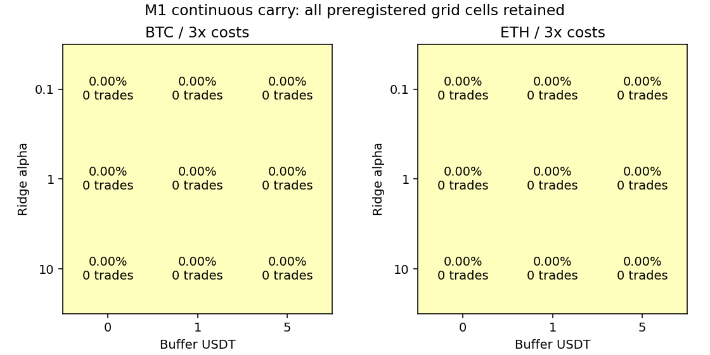

# BTC/ETH 研究轮次：2026-10-01 07:35 UTC

## 本轮结论

**18 个 M1 Ridge 连续配置、两个原生 M1 单次案例实际运行，共 60 个成本场景；全部没有合格入场，交易数和净收益均为零。0 个候选通过预设门槛。** 18 个参数格点、两个具体案例和一个初始聚合范围分别完成 reserve/finish，共 21 项，全部 rejected，结果与失败记录永久保留。

补齐的是初始 M1 简写范围的真实 24h 案例证据。原初 16 条现在均有关联的实际回测结果；**这不表示 16 条策略通过稳健性验证，也不表示原 M1 的全部 8h 示例已经补测。** 原生短案例和连续扩展的验证范围分开列明。

| 配置范围 | 1 倍净收益 | 2 倍 | 3 倍 | 整体回撤 | 往返数 | 结论 |
|---|---:|---:|---:|---:|---:|---|
| BTC：alpha 0.1/1/10 × buffer 0/1/5，共 9 格 | 0% | 0% | 0% | 0% | 0 | 无合格入场，淘汰 |
| ETH：同上，共 9 格 | 0% | 0% | 0% | 0% | 0 | 无合格入场，淘汰 |
| 原生 M1：BTC/ETH、24h、alpha=1、buffer=1 | 0% | 0% | 0% | 0% | 0 | 实际 no_trade，恢复证据，未通过资格验证 |

所有格点和逐折的净收益、回撤、Sharpe、Calmar、成本及模型证据见 [report.json](report.json) 与 [sensitivity.csv](sensitivity.csv)。零波动路径的 Sharpe/Calmar 为 null，没有填造正值。现金保有结果不能称正收益方法。

## 假设与实际经济证据

沿用原 M1：训练内 Ridge 预测对冲持有的成本后收益，大于预定 USDT 缓冲才买现货、等数量卖永续，固定持有 24 小时。预设 Ridge 正则参数与缓冲的双轴邻域，不在 OOS 上换参数或降低成本。

全部连续模型在各自 672 小时测试折预测的归一化净收益均为负，即使 buffer=0 也没有可执行信号。连续标签按 10,000 USDT 名义 NAV、每腿 25% 生成，每币 8,232 个可成熟历史标签：

| 描述性历史标签 | 平均执行成本 USDT | 平均资金费收入 USDT | 标签净损益范围 USDT | 正标签数 |
|---|---:|---:|---:|---:|
| BTC 24h | 10.4198 | 0.2140 | -13.4582 至 -6.7846 | 0/8,232 |
| ETH 24h | 10.6751 | 0.1608 | -22.5191 至 +0.8254 | 1/8,232 |

标签不是另外增加的策略候选，以上是已保留开发数据的描述，不用来挑选 OOS 最优模型，也不是独立预测业绩。绝大多数时段的资金费和基差损益不足以覆盖完整双腿往返成本。

## 三项验证

### 时间滚动：连续扩展已完成，未通过收益门槛

复用真实 2025-09-16 至 2026-09-16 的分钟 spot/perp、小时 mark 和实际资金费。测试区间 **2026-03-18 00:01 至 2026-09-02 00:01 UTC**，之前 180 日滚动训练、3 日 embargo、28 日测试/步长，共 6 折。该历史已经反复研究，只能叫开发验证，不能叫未触碰最终留出。

训练行须同时满足 decision 在训练范围、label_end 和 label_available 严格早于训练截止。每折真正不成熟标签剔除 24 行；首折另有 503 行缺乏滞后 21 日成本暖机标签，实际训练 3,792 行，随后每折 4,296 行。首份诊断曾把首折总排除 527 行统称未成熟；finish 前已分开这两个原因。没有把资金费结算时点当作其已发布时点。

因子使用原 `factor_frame`，可得时间不得晚于决策；只用训练内覆盖率≥98%的列，再在训练内拟合中位数填充、StandardScaler 与 Ridge（sklearn 1.7.2，SVD）。连续模型全部采用 F01/F02/F03/F04/F06/F07；其他缺真实历史输入的因子保持 null，未用合成 OI、indicative funding、taker flow 或盘口替代。核心六因子的定义与全部训练行索引、系数、截距、填充/缩放值和每小时预测均保留。

模型在每个测试折首个信号时从 embargo 之前的成熟训练数据拟合，参数事先固定，没有验证/OOS 参数选择。原生标签用原定 fixed quantity，数量在第一条公开测试信号价可见后作为 sizing 常量重标历史标签；不会使用未来测试收益。最初诊断把模型可用时间写成训练截止，finish 前已纠正为测试首信号，并在 report 留下注释；系数、预测和净值没有改变。

连续决策使用小时已结束收盘，下一 T+1 分钟真实开盘成交，T+24h 到期信号于下一分钟退出；数量按决策时可见 NAV 与当前 spot 确定，信号到成交之间实际资金费先结算给旧仓。相邻折连续持仓/净值，不重置本金。中间折边界为交易前 NAV，最后含平仓成本；逐折连乘与完整净值一致。净值按小时下一分钟真实 spot/perp 开盘参考价采样，整体回撤不是分钟 mark 最大回撤。此次所有路径为现金，1 倍正收益折数都是 0/6。

### 双参数敏感性：已完成，没有正收益平台

每币 `ridge_alpha={0.1,1,10}` × `buffer_usdt={0,1,5}`，持有 24h、每腿 25%、其他规则固定。18 个实际配置分别事前登记，同 alpha 的拟合模型在三个缓冲配置之间复用；各配置的三档成本仍独立计算并归档。

每币三倍成本正收益邻域为 **0/9**，并非正收益平台或孤立盈利峰值。全部相邻格点的收益差与可用 Sharpe 差保存；当前 Sharpe 不定义时差也为 null，不用零收益充当稳健性通过。



### 成本压力：60 场景实际运行，零成交不能证明成交稳健性

连续配置本金 10,000 USDT，独立 spot 现金/perp 抵押各 5,000，无转账。每腿名义敞口为决策 NAV 的 25%，总名义约 50%，原值保留，没有归一化。两腿共同 lot 等数量，没有现货空头或借币。

每侧 spot 10bp、perp 5bp 手续费、半价差 1bp、滑点 2bp，再加 `0.5 × 前20完整日价格波动率 × sqrt(订单名义/前20日平均日成交额)` 冲击，参与率上限 0.1%，tick 向不利方向取整。资金费用实际时间、费率、对应实际 settlement mark；压力放大支付资金费，不放大收入。模型训练标签和预测用固定基准成本，各压力场景只改变实际成交摩擦和支付资金费，未因更高成本改变预测门槛。

1/2/3 倍成本路径均真实执行评估，但实际没有成交，因此实际交易费/资金费为零。**成本公式在训练标签中已核对，并不构成真实成交滑点、冲击、容量或正收益稳健性证据。** 当前规则已因无收益、无交易、邻域不正、成本安全余量不可计算而淘汰。维护保证金假设为真实小时 mark high 下 1% 名义，当前元数据冻结后用于历史；没有借币，也没有触发实际已执行现金/保证金违例。历史清算档位、L2、费率等级和美元锚仍不完整。

## 原生证据与已有基准复用

两个原生案例使用原 `CarryStrategy`/Nautilus 2.0.0rc5，2026-03-18 至 03-21，24h 固定持有、alpha=1、buffer=1、45% 初始资本计算共同 lot。模型只用最初 180 日成熟原生 24h 标签、3 日间隔，72h 内冻结。原 `label_frame` 其他 horizon 仅为内部标签输出，不拟合额外策略；本轮只用 24h。原生模型训练列只有 F03/F07，其余列暖机缺失导致覆盖低于门槛，按原规则剔除。

原生采用完成小时报价，下一条共享记录入场（延迟约 1h）、已知 24h 期限同报价退出，实际单笔若发生约持有 23h；此轮没有任何入场。spot/perp 原费率 10bp/2bp、每腿 flat 执行 5bp，三档成本压力保留实际 native 输出。**原生短案例仅恢复真实结果，不含成交量冲击或长期双轴资格；完整三项评估在连续扩展完成。** 原初 M1 范围仅是多币种/8h与24h简写，关联具体24h案例不代表全部例子验证完成。

直接读取并校验上一轮 45% 初始资本 spot 持有基准，不重新计算相同配置：BTC 1/2/3 倍收益 2.044/1.922/1.800%，ETH 1.864/1.740/1.617%；现金为零。其方向与总名义敞口不同于本轮对冲，不声称等风险比较。原 benchmark report 和曲线哈希均记录。

## 数据、审计、登记和复现

- BTC/ETH 各 spot/perp 525,600 条连续真实分钟线、8,760 小时 mark、1,095 次实际 funding；复用缓存。162 个官方 ZIP checksum、规范化数据、前轮真实 REST mark 缺口补取、冻结 spot 元数据及依赖代码哈希核对保留，无大行情/凭据提交。
- [spec.json](spec.json) 固定完整计划，specs/ 保存每项定义，batch.json 对应指纹。21 次 reserve 在任何标签/模型/策略计算之前成功；21 项 finish 均有真实证据。累积去重定义 126，真实的登记前尝试总数未知，不能声称已校正多重试验后的显著性。
- 独立按现金流与不利 tick 重建 **16,464 个真实连续 24h 标签**，核对实际资金费对应区间和发布时间；逐日确认 ADV/波动率只看过去完整日期。另用训练标准化矩阵的 Ridge 正规方程核对 **38 次实际模型拟合**，全部训练索引、系数与预测一致。
- 检查 **60 个归档成本场景**、**217,782 个连续小时净值点**、六折连乘、原生账户与外部 NAV；核对源码/真实行情/原基准哈希。零交易路径也永久留档，不改回 result_available=false。
- 新时序检查先因尚无模块而失败，再通过；第一次连接原有 carry 模块路径失败后显式注册模块修正。没有把这些环境错误写成策略损益；时序失败日志保留。原 `checks/research.py`（可得时间、标签 purge、训练预处理、原生 PNL）实际通过。
- 已登记报告不允许改写，审计重放只比较冻结输出，不更新登记或再次搜索参数。全部 features/labels、模型、预测、决定、成交/资金费和连续净值以确定性 gzip JSON 存在 results/；相同缓冲的零交易结果共用 Git blob，仍各有独立 spec/finish。归档体积约 12 MiB 工作文件、Git 唯一内容约 6 MiB，没有原始大行情。

```bash
PYTHONPATH=src OPENBLAS_NUM_THREADS=1 OMP_NUM_THREADS=1 .venv/bin/python checks/research.py
OPENBLAS_NUM_THREADS=1 OMP_NUM_THREADS=1 .venv/bin/python research/experiments/20261001T073555Z/check_timing.py
OPENBLAS_NUM_THREADS=1 OMP_NUM_THREADS=1 .venv/bin/python research/experiments/20261001T073555Z/check_evidence.py --finished
python3 checks/strategy_registry.py
OPENBLAS_NUM_THREADS=1 OMP_NUM_THREADS=1 .venv/bin/python research/experiments/20261001T073555Z/evaluate.py --reproduce
```

命令在研究 worktree 根目录执行，需要 manifest 所标同哈希缓存和已安装版本。`prepare.py`/`complete.py`/`finish.py` 仅用于本轮完成前的登记和归档，不是已结束轮次的重放命令。真实执行日志见 *_stdout.log、evidence_before_finish.log、evidence_after_finish.log、original_research_checks.log 与 registry_after_finish.log。

本轮 18 个新候选未通过；不以零交易结果宣称“稳定盈利”。下一批优先探索另行事前登记的较长持有期限或低换手趋势/组合，先检验资金费能否覆盖完整成本，再做成熟标签、邻域、压力和前向模拟验证。本轮 24h 网格已经实际完成，不重复搜索。

主要研究实现来源：[本仓库原模型与核算](https://github.com/shenmuegit/EquiTide/tree/00ea316b77e0ca506f80fe13d7f5486ea4804294/src/usdt_quant)、[sklearn 1.7 Ridge](https://scikit-learn.org/1.7/modules/generated/sklearn.linear_model.Ridge.html)、[训练预处理与泄漏说明](https://scikit-learn.org/1.7/common_pitfalls.html)、[Binance 官方数据归档](https://github.com/binance/binance-public-data)、[实际资金费接口](https://developers.binance.com/docs/derivatives/usds-margined-futures/market-data/rest-api/Get-Funding-Rate-History)。版本、访问日期及哈希见 report；以上是历史模拟，尚无合格正收益方法。
