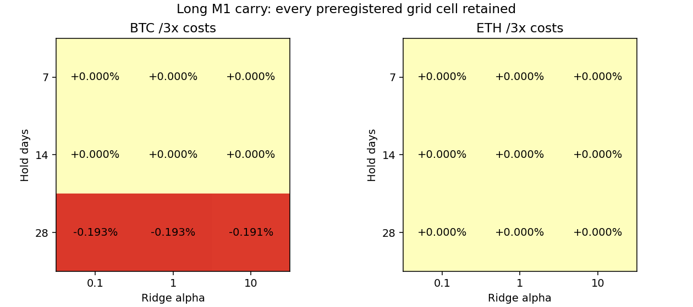

# BTC/ETH 研究轮次：2026-10-01 09:36 UTC

## 结果

**18 个长持有期 M1 配置、两个原生 8h 案例、两个同期持有基准实际完成，共 66 个成本场景，22 项分别 reserve/finish。0 个候选通过预设门槛。** 全部正收益、负收益、零交易结果都保留，没有看 OOS 后换网格或门槛。

- BTC 28 天配置在一倍成本下有极小正收益，每格仅一次往返；两倍、三倍均转为亏损。
- 其余 15 个长持有期配置、两个原生 8h 案例没有合格入场，实际收益为零。零交易是完整评估结果，不是缺少回测。
- 三倍成本每币邻域正收益均 **0/9**，没有正收益平台。尚未找到经成本和稳健性验证的合格方法。

| 配置 | 1 倍净收益 | 2 倍 | 3 倍 | 三倍整体回撤 | 往返 | 一倍正收益折 |
|---|---:|---:|---:|---:|---:|---:|
| BTC 28d，alpha=0.1 | +0.01735% | -0.08772% | -0.19279% | 0.19279% | 1 | 1/4 |
| BTC 28d，alpha=1 | +0.01735% | -0.08772% | -0.19279% | 0.19279% | 1 | 1/4 |
| BTC 28d，alpha=10 | +0.01521% | -0.08770% | -0.19058% | 0.19058% | 1 | 1/4 |
| BTC 7d/14d，全部 alpha | 0% | 0% | 0% | 0% | 0 | 0/4 |
| ETH 7d/14d/28d，全部 alpha | 0% | 0% | 0% | 0% | 0 | 0/4 |
| 原生 M1 8h BTC/ETH | 0% | 0% | 0% | 0% | 0 | 短案例，不列长期折数 |

收益为 112 日 OOS 的累计值，不是年化。全参数、逐折 Sharpe/Calmar、交易、资金费与连续净值见 [report.json](report.json)、[sensitivity.csv](sensitivity.csv) 和 results/。零波动路径的 Sharpe/Calmar 保持 null。

## 方向、查重与初始补测

经济假设：延长固定持有期可积累更多实际资金费，降低每单位时间的双腿往返成本；仍须模型在成熟训练标签上预测成本后净收益大于 1 USDT 才入场。固定网格是每币 `holding_hours={168,336,672}` × `ridge_alpha={0.1,1,10}`，每腿 25% NAV、buffer=1，18 个真实新配置。上一轮 24h 网格及已有案例不再计算。

先读取完整 276 行登记簿和此前实验/既有 walk-forward 结论：126 个去重配置，初始 16 条都有实际证据，无 pending、无未推送工作。本轮新增 22 个完整配置，累计 **148 个去重定义**；不同持有期、日期、参数和资金占比按实际配置登记，不用改名或增加无关字段制造新颖性。

两个未跑过的原生 M1 8h BTC/ETH 案例分别预登记。加上上一轮 24h 两个案例，初始 M1 简写的两个币种、8h/24h 示例现在都有具体实际记录。**原生 72h 案例只恢复实际证据，不能据此称这些策略长期稳健性通过。** 原始范围登记与旧报告保留，不修改过去的结论或重跑已完成配置。

## 三项验证

### 时间滚动：四折完成，未通过收益/交易证据门槛

使用真实缓存 2025-09-16 至 2026-09-16 的行情、小时 mark 和实际资金费。之前 180 日滚动训练、**56 日 embargo**、28 日测试/步长，共四个连续折；56 日按最长 28 日标签的两倍事前固定。测试为 **2026-05-10 00:01 至 2026-08-30 00:01 UTC**。时间隔离加长后，一年缓存只能提供四折；没有把这一批冒称前轮六折，也没有把反复研究的历史称未触碰最终测试集。

训练仅保留 decision 在训练范围、label_end 和 label_available 都严格早于训练截止的行。各持有期每折实际 purge 168/336/672 行；首折另排除 503 行缺乏滞后 21 日成本暖机标签，分别训练 3,648/3,480/3,144 行，之后三折分别 4,152/3,984/3,648 行。按真实资金费发布时间过滤，没有把已结算但未发布的费率提前送入特征或模型。

复用上一轮已保存的原 `factor_frame` 特征，重新核对 archive、行情和原始因子源码哈希及可得时间；只复用特征，没有重跑旧 24h 标签、模型或策略。因子覆盖≥98%、中位数填充、StandardScaler 和 Ridge SVD 均只拟合训练段；每折测试首信号才拟合，各 alpha 固定，不用 OOS 选模型。长持有模型使用 F01/F02/F03/F04/F06/F07；缺真实 OI、indicative funding、taker flow、跨所费率与 L2 的因子为 null，不伪造输入。全部训练索引、标准化值、系数、截距和小时预测保留。

标签按固定 10,000 USDT、每腿 25% 名义、当时 spot 价/共同 lot 确定数量，真实 T+1 分钟开盘入、T+H+1 分钟开盘出；计实际 `(entry,exit]` 资金费与全部成本。标签的未来成交/成本/资金费是训练目标，只有完全成熟后才允许训练，不是特征。实际交易数量按当时已结算、决策可见 NAV 决定；决策至成交间资金费先给旧仓，不能给新入场仓位或提前用于 sizing。

相邻折连续持仓、账本和净值，不重置本金。中间折边界为下一折交易前 NAV，最终含平仓成本；逐折连乘与完整曲线一致。整体回撤来自完整小时采样 NAV，按下一分钟 spot/perp 开盘参考价标记，不是分钟 mark 最大回撤。BTC 28d 各格都只有一次往返、1/4 正收益折，低于事前至少两次往返、3/4 正收益折门槛。

### 双参数敏感性：18 格全部完成，三倍邻域没有正收益

同时变化固定持有期与 Ridge 正则强度，每币九格。BTC 28d 的一倍微利在持有期网格边缘，alpha=0.1 与 1 的实际成交路径相同但预测不同；alpha=10 的入场时间略有变化。它没有在成本压力下形成盈利平台。ETH 所有配置均未达到 1 USDT 缓冲。

report 保存三档成本全格点的多指标与相邻参数收益/Sharpe 变化；零波动 Sharpe 差不定义时也为 null。没有从 OOS 挑一个最优参数再把相同历史叫独立验证，登记前历史尝试总数仍未知，不填造多重选择校正后的显著性。



### 成本压力：真实已成交路径核对，微利无法覆盖压力

本金 10,000 USDT，独立 spot 现金/perp 抵押各 5,000，无转账。每腿名义金额为决策 NAV 的 25%，总名义约 50%，保持原资金占比，不自动归一化。两腿相同共同 lot 数量，无现货空头或借币。

假设每侧 spot 10bp、perp 5bp 手续费，半价差 1bp、滑点 2bp，并加入 `0.5 × 前20完整日 log-return 波动率 × sqrt(订单名义 / 前20完整日平均成交额)` 冲击。每币每腿用各自真实 volume，参与率≤0.1%，tick 向不利方向取整，退出也计成本。1/2/3 倍放大手续费、价差、滑点、冲击及支出资金费；收入资金费不放大。预测和入场门槛固定基准成本，压力仅作用于实际账本。

BTC 28d、alpha=0.1/1 的一倍资金费合计 **12.10097 USDT**，执行成本 **10.50228 USDT**，最终净利润 **1.73519 USDT**；毛损益/执行成本比 **1.1652**。alpha=10 的该比值 **1.1478**，都低于事前 2.5 目标。三倍实际成本分别约 **31.49906/30.84911 USDT**，净亏损约 **19.27927/19.05807 USDT**。单次微利不能据此称可稳定运行。

全部三档按实际 API 结算时间（保留毫秒偏移）、真实 rate、对应真实 settlement mark 计费，共核对 756 次实际持仓结算。每笔真实参考价、tick、费用、冲击、资金费原值/压力增量和账本 NAV 都保存。无已执行 spot 现金负余额或保守小时 high 下 1% 维护比例违例；当前元数据和简化维护比例用于历史是明确假设，没有历史清算阶梯或自动清算路径。实际 L2/TCA、费率等级、美元锚/托管风险等仍不足；未成交路径不能证明成交稳健性或真实容量。

## 真实历史标签的成本筛选

每腿名义 2,500 USDT 的开发标签描述如下。只用于说明既定标签分布，没有新增策略评估、用于择优或称为预测 OOS 收益。

| 币种、持有期 | 平均执行成本 USDT | 平均资金费 USDT | 成本后正标签比例 |
|---|---:|---:|---:|
| BTC 7d | 10.3905 | 1.4826 | 0% |
| BTC 14d | 10.3655 | 2.9852 | 0% |
| BTC 28d | 10.3054 | 5.8521 | 30.42% |
| ETH 7d | 10.6439 | 1.1486 | 0% |
| ETH 14d | 10.6108 | 2.3193 | 0% |
| ETH 28d | 10.5441 | 4.5157 | 11.37% |

7/14/28 日每币分别有 8,088/7,920/7,584 个完整标签。28 日部分真实历史时段为正，不表示事前模型能找到它们；四折模型的实际预测与成交已另外保存。

## 原生 8h 与同期基准

原生 M1 用原 `CarryStrategy`/Nautilus 2.0.0rc5，实际 2026-03-18 至 03-21 的 72h 报价/资金费输入，Ridge alpha=1、buffer=1。固定共同 lot 数量由首个公开信号价、45% 初始 NAV 决定，首信号时已知，仅重标成熟历史标签，不使用未来测试收益。180 日成熟 8h 专属标签训练、3 日隔离，模型在该案例 72h 内冻结；没有套用上一轮 24h 模型。

8h 标签是原 `label_frame` Decimal 核算在固定 8h 下的等价扩展：下一条完成小时报价入场（约 T+1h）、已知 T+8h 报价退出，实际单笔若成交约持有 7h。原 spot/perp 费用 10bp/2bp、flat 每腿执行 5bp，支出资金费与执行成本压力 1/2/3 倍。两个案例都是实际 no_trade；它们没有长区间、容量冲击或双参数资格验证，完整三项验证属于另行登记的连续扩展。

两个新基准是同一 112 日、25% 初始资本 spot 持有加 75% 现金，入/退计全部成本。日期和资金占比均不同于既有基准，因此分别事前登记并实际计算：

- BTC 一/二/三倍净收益 **-0.83009/-0.89478/-0.95946%**，三倍回撤 7.35720%。
- ETH **+1.32816/+1.25988/+1.19160%**，三倍回撤 9.19113%。
- 现金基准为零。方向 spot 与 matched carry 的敞口/风险不同，不冒称等风险比较。基准 rejected 只表示不是本轮双参数资格候选，不表示 ETH 持有收益为负。

## 数据、独立检查和归档

- BTC/ETH spot/perp 各 525,600 条真实连续分钟线、8,760 小时 mark、1,095 次实际资金费，复用已有缓存。162 个官方 ZIP checksum、规范化文件 SHA256、先前真实 REST mark 缺口补取、冻结元数据与来源 manifest 再次核对；大行情和凭据不提交。
- 独立现金流/tick/手续费/结算重建 **47,184 个长持有标签和 17,502 个原生 8h 完整标签**，核对发布时间与 `(entry,exit]`；每个日成本输入只用之前完整日期。原生尾部缺完整出口的标签明确为 null/reason，不填造价格。
- 用独立 Ridge 正规方程核对 **74 次训练拟合**、所有索引/填充/缩放/系数与小时预测。逐场景独立 combined cash+inventory 重建 **161,340 个连续小时 NAV 点**，并核对独立两账本现金/维护约束、756 次实际资金费、模型入场预测、四折连乘和原生账户 NAV。
- 审计重放重新计算全部新标签、74 次模型和 **66 个完整成本场景**，与冻结归档逐项完全一致，不改已 finish 报告，不作为再次研究相同配置。登记簿与本轮所有源码/数据/旧特征 archive 哈希核对通过。
- 时序检查先因尚无实现模块而失败，再实际通过；失败日志保留。22 次 reserve 均成功且发生在任何标签/模型/策略计算之前；22 项全部 finish 为有真实结果的 rejected。初始 16 条实际证据保留，没有 pending；累计 148 个去重定义。
- results/ 包含 44 个确定性 gzip JSON，合计约 9.21 MiB，保存所有实际模型、标签、决定、成交/资金费及净值。只复用旧因子 archive，未重复提交大行情。完整计划见 [spec.json](spec.json)，具体配置见 specs/，执行/失败/审计日志均保留。

```bash
OPENBLAS_NUM_THREADS=1 OMP_NUM_THREADS=1 .venv/bin/python research/experiments/20261001T093625Z/check_timing.py
OPENBLAS_NUM_THREADS=1 OMP_NUM_THREADS=1 .venv/bin/python research/experiments/20261001T093625Z/check_evidence.py --finished
python3 checks/strategy_registry.py
OPENBLAS_NUM_THREADS=1 OMP_NUM_THREADS=1 .venv/bin/python research/experiments/20261001T093625Z/evaluate.py --reproduce
```

命令在研究 worktree 根目录执行，需要同哈希缓存、先前因子 archive、报告所列 Python/numpy/polars/sklearn/Nautilus 版本。`prepare.py`、`complete.py`、`finish.py` 是本轮结束前流程，不是已完成轮次的重放命令。没有真实订单、没有 main 合并、没有子代理。

下一批优先另行预登记低换手趋势或已有组件的新资金权重组合；保留已有真实净值，组合时对齐时间/资本/再平衡成本，不平均 Sharpe。单次资金费微利没有成本安全余量，不能据本轮调整 OOS 后改口为通过；本批精确配置不会重复搜索。所有结果，包括亏损和零交易，都保存并提交推送。

来源：[原模型/账本/因子代码](https://github.com/shenmuegit/EquiTide/tree/0b3e2fd314465595a5dd79e1a29304007d7128d2/src/usdt_quant)、[sklearn 1.7 Ridge](https://scikit-learn.org/1.7/modules/generated/sklearn.linear_model.Ridge.html)、[训练预处理与泄漏说明](https://scikit-learn.org/1.7/common_pitfalls.html)、[Binance 官方真实归档](https://github.com/binance/binance-public-data)、[实际资金费接口](https://developers.binance.com/docs/derivatives/usds-margined-futures/market-data/rest-api/Get-Funding-Rate-History)。固定版本、访问日期及哈希见 report。当前没有合格的稳定正收益证据。
