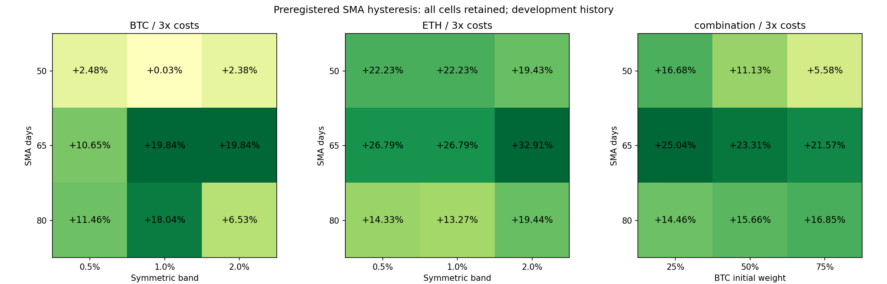

# BTC/ETH 研究轮次：2026-10-01 11:36 UTC

## 结果

**39 个预登记研究配置完成 117 个真实成本场景；另一个持有比较组合补登记并保存三场景，共 40 项 finish、120 个成本场景。1 个研究组合达到本轮事前固定的历史验证门槛，38 个研究配置淘汰。** 比较组合的首次计算未事前登记，偏差及首次结果/源码快照永久保留，详情见下文。没有用补登记冒充事前登记。

保留候选：**SMA65、对称 ±1% 进出场缓冲带、初始 BTC75% / ETH25%**。本金 2,000 USDT，BTC 分仓 1,500、ETH 分仓 500；权重不自动归一化，不是每日维持的目标权重。每个分仓现金与持币独立，没有分仓间转账或再平衡。候选指纹 `ef731f4b8139793a41a7df940652afdaaa1cc28933885756e2f73c9275ea86da`，完整定义见 [组合 spec](specs/combo_n65_btc0.75.json)。

| 成本 | 180 日累计净收益 | 完整日线净值回撤 | 日收益年化 Sharpe | 实际执行成本 USDT | 成本/初始本金 | 正收益折 |
|---|---:|---:|---:|---:|---:|---:|
| 1 倍 | +23.02434% | 12.04558% | 1.61608 | 12.41144 | 0.62057% | 4/6 |
| 2 倍 | +22.29731% | 12.27749% | 1.57243 | 24.74469 | 1.23723% | 4/6 |
| 3 倍 | +21.57475% | 12.50878% | 1.52873 | 37.00029 | 1.85001% | 4/6 |

每个成本场景共 **10 次成交、5 次组件往返**（BTC 两次、ETH 三次）；组合往返数是组件次数之和，不是五次完全同步的组合开平。1 倍参考价毛损益/执行成本比 **38.1018**，3 倍 **12.6619**；无现金或持币负余额。38 个淘汰配置也全部正收益，失败原因是只有 2–3 个正收益折，没有达到 4/6 门槛；没有把 rejected 当成亏损。

**passed 只表示通过这一批预先固定的开发历史门槛，保留进入后续未使用数据的模拟观察；不表示稳定实盘盈利。** 组合收益集中在最后一折：一倍成本前五折合计 **-0.88089%**，最后折 **+24.11768%**；三倍前五折 **-1.78386%**，最后折 **+23.78286%**。虽然收益邻域都为正，只有 1/9 个组合满足全部门槛，而且 BTC75% 位于本轮权重网格边缘。不能把它称为已经稳定运行的方法。

## 经济假设与完整批次

新的假设是价格在均线附近反复穿越时，对称缓冲带可减少换手与成本；组合的两条有成本净值可能改善逐折表现。SMA 是现有论文/仓库方向，缓冲带是本轮明确的新扩展，不是论文的原参数或公开业绩复刻。

规则在看 OOS 前冻结：空仓时，上一已完成日线 close **严格大于 SMA(N) × (1+band)** 才入；持仓时，close **严格小于 SMA(N) × (1-band)** 才出；等号与缓冲带内维持状态。SMA 包含截至上一日的 N 个完成收盘。OOS 首决策空仓，历史只用于指标暖机，不继承没有出资的假想仓位。下一 UTC 00:01 的真实分钟开盘成交，分仓全部可用现金买现货，USDT 利息为零。

- 18 个核心配置：BTC/ETH × `N={50,65,80}` × `band={0.005,0.01,0.02}`，每格 1,000 USDT。
- 12 个额外资金规模组件：BTC/ETH × 三个 N × band=0.01 × 本金 `{500,1500}`。这些不是先用千元净值线性缩放；分别事前 reserve，以实际现金、数量和 ADV 冲击重新计算，全部 finish。
- 9 个组合：band 固定 0.01，两个币同 N，三种 N × BTC 初始权重 `{0.25,0.5,0.75}`；ETH 对应 `{0.75,0.5,0.25}`，本金 2,000。组合直接相加已经按对应本金计算的两条绝对 NAV，不二次乘权重，不平均 Sharpe，不再回测组件；无再平衡所以无新增再平衡成本。
- 同期旧 BTC/ETH 千元持有曲线、费用和成交全部直接复用，未重算旧策略。另行组合的等资金持有比较在发现登记偏差后补登记，首次计算与补救均留档。

研究开始先读取完整 320 行历史、150 个保留 ID、**148 个去重定义**、全部既往实验结论及旧 freqtrade/walk-forward 结果。初始 16 条均已有实际证据，无 pending、无未推送工作。本批不同规则、参数、实际资金规模与组合权重确为新配置；全部 finish 后共 **188 个去重定义**，无 pending。历史登记以前的试验总数仍未知，存在多重选择偏差，没有填造校正后显著性。

## 三项验证

### 时间滚动：六折完成，组合达到固定门槛

按仓库技能分割真实 365 日缓存：180 日滚动历史窗、3 日 embargo、30 日测试/步长，共六个连续折。测试 **2026-03-18 00:01 至 2026-09-14 00:01 UTC**，180 个决策日。这里规则、参数、权重固定，无模型、标签、填充、训练内选参或预处理拟合；历史窗用于分割/暖机，不声称从训练收益找到了最优参数。当前已经公开的历史收盘可进入当前指标，间隔不用于禁止已知价格的正常观察。无前向监督标签，purge=0。

折间持仓、现金和状态连续，不重置资本、不强制平仓。中间边界用完成日收盘 NAV，最终包含下一分钟终止平仓成本；逐折收益连乘等于整体曲线收益。整体回撤取完整 182 点日线/终止净值，不是最大单折回撤，也不是分钟内最大回撤。每格逐折收益、回撤、Sharpe、Calmar 与完整现金流均保留；零回撤导致 Calmar 未定义时保留 null。

候选逐折累计净收益：

| 折 | 起始决策 UTC | 1 倍 | 2 倍 | 3 倍 |
|---|---|---:|---:|---:|
| 1 | 2026-03-18 00:01 | +4.80178% | +4.59497% | +4.38882% |
| 2 | 2026-04-17 00:01 | +1.16733% | +1.17285% | +1.17835% |
| 3 | 2026-05-17 00:01 | -4.47217% | -4.59991% | -4.72757% |
| 4 | 2026-06-16 00:01 | +0.31492% | +0.28205% | +0.24937% |
| 5 | 2026-07-16 00:01 | -2.44422% | -2.54079% | -2.63735% |
| 6 | 2026-08-15 00:01 | +24.11768% | +23.95022% | +23.78286% |

2025-09-16 至 2026-09-16 的历史已多次使用，明确是开发验证历史，**不是未触碰最终测试集**。当前正收益结果也不能消除反复研究与市场阶段集中的偏差。

### 双参数敏感性：全网格完成，盈利平台与完整资格不同

核心分别同时变化 N 和 band；组合同时变化 N 和 BTC 初始权重。BTC、ETH、组合各九格，在一/二/三倍成本均 9/9 正收益、9/9 正 Sharpe。12 个资金规模变体另列完整结果；39 个研究配置在三倍成本下均正收益，没有隐藏失败变体。

| 组合 N | BTC25% 三倍收益 | BTC50% | BTC75% | 相应一倍正收益折数 |
|---|---:|---:|---:|---|
| 50 | +16.67699% | +11.12912% | +5.57579% | 2、2、3 |
| 65 | +25.04335% | +23.31133% | +21.57475% | 3、3、4 |
| 80 | +14.46131% | +15.65658% | +16.84791% | 2、2、3 |

三倍收益范围：BTC 核心 **+0.02577% 至 +19.83687%**，ETH **+13.27452% 至 +32.91455%**，组合 **+5.57579% 至 +25.04335%**。BTC50/1% 的余量很小；N50→65 的一些格点有较大 Sharpe 跳变。report 留存全邻接收益/Sharpe 差及 2sd 描述性 cliff 标记，标记不是显著性检验。只有一个组合达到逐折门槛，说明“附近累计收益为正”与“附近都达到完整资格”不是同一结论。没有在看到结果后变更网格、时间、权重或失败判据。



### 成本压力：真实价格与成交量核算完成

复用已有日线执行账本，每侧 spot 手续费 10bp、半价差 1bp、滑点 2bp；加 `0.5 × 前20完整 UTC 日 close 对数收益样本波动率 × sqrt(参考订单预算 / 前20日平均真实 quote volume)` 冲击。买入用扣成本前现金预算作保守参考订单上界，卖出用实际数量 × 真实参考价；完全不用当前或未来日成交量。1/2/3 倍同时放大手续费、价差、滑点与冲击，终止卖出也计成本。无杠杆、现货空头或借币，资金费/借币/永续保证金不适用。

候选一倍成本分项：手续费 **9.47124**、半价差 **0.94714**、滑点 **1.89428**、冲击 **0.09879 USDT**；三倍分别 **28.23545/2.82367/5.64734/0.29382 USDT**。三倍压力中更低现金会改变下一次可买数量，因此成本金额不是机械将一倍美元金额乘三。实际信号和成交日期不随成本调参。候选最大参考订单/滞后日 ADV 约 **1.69e-6**，低于事前 0.001 约束；这只是声明规模下的 ADV 检查，不是实盘容量或盘口保证。

执行仍是原有浮点数量模拟，没有新增历史 tick/lot/min-notional、实际 L2、费率等级或分钟容量校准。可参考轻量账本进行经济筛选，不能把这一条模拟通过称为交易所实盘执行已经验证。日线 NAV 也不能给出盘中最大回撤，USDT 脱锚/托管等未被本次收益核算覆盖。

同期 BTC/ETH 各 1,000 USDT 持有基准直接复用旧净值，三倍收益 **+3.12238% / +5.98956%**，回撤 **28.68914% /35.18644%**；现金为零。等初始资金的两币持有组合三倍 **+4.55597%**，整体日线回撤 **31.09296%**，本金 2,000。候选75/25与该50/50持有基准方向/现金暴露不同，不声称等风险比较。

## 固定门槛与登记偏差

门槛在计算前写入 spec.json：三成本均正收益；一倍至少 4/6 正收益折；三倍整体回撤≤25%；预设双轴邻域三倍正收益比例≥60%；一倍至少两次组件往返；一倍参考毛损益/执行成本≥2.5；无负现金/持币。核心18、规模变体12全部未过逐折门槛；组合9中只保留65/1%/BTC75%。比较配置 rejected 表示比较对象，没有完整双轴资格，不表示持有亏损。

独立检查后复核登记流程发现：`benchmark_reuse.equal_capital_portfolio` 从两个旧持有组件算出新的组合比较指标，首次未给这个组合自身 reserve。39 个研究配置的 reserve 先后顺序正确，核心及组合结果不受影响。补救按实际事实留档：

1. 先保存 [首次 report 快照](first_evaluation_report.json.gz) 与 [首次源码快照](first_evaluation_sources.json.gz)，不删除或重写首次结果。
2. 固定 [比较组合 spec](specs/benchmark_hold_equal2000.json)，成功 reserve，再从原已成本化的千元组件净值恢复三条完整组合曲线；没有重跑旧持有或本轮39研究路径。
3. [protocol_deviation.json](protocol_deviation.json) 明确首次计算早于 reserve；最后该比较配置以实际结果 finish 为 rejected。审计专门验证这一例外和快照，不能把它称为事前登记合规。

这不是新的独立资格验证或改变研究门槛。后续任何实际计算的新组合比较也必须先 reserve，包括只从已有组件相加的组合。

## 数据与复现证据

- 真实 BTC/ETH spot 各 **525,600** 分钟，合成 365 个完成 UTC 日；00:01 的真实 minute open 为可执行参考价。两币时间轴相同，分钟连续、is_closed、available_ts=minute open+60s 均再次核对。
- 复用第一轮真实缓存，重新验证 **54 个官方 ZIP 的发布 CHECKSUM**、规范化文件 SHA256、旧 manifest/原账本/技能分割代码、本轮源码和全部具体 spec 哈希。原始行情不提交，派生完成日线输入以轻量 gzip 保存。
- 独立 Decimal 再建 **5,400 个因果决策、552 次新研究成本化成交、21,840 个研究/比较日线 NAV 点**；核对完整真实 ADV/波动率、价差/滑点/冲击/手续费、资金规模、无转账组合、逐折连乘、全部多指标、登记顺序/报告哈希与比较偏差快照。
- 40 项均 finish，研究组合1项 passed，其余研究38项与比较1项 rejected；全部正收益结果保留。初始16有实际证据、无 pending。完整审计重放 **120 场景与整个 report 完全一致**，不追加重复研究记录或改冻结结果。
- [report.json](report.json)、[sensitivity.csv](sensitivity.csv)、results/ 保存所有逐配置/逐成本/逐折结果、真实决定与成交、完整净值、源哈希。时序先失败/后通过、计算、检查、恢复比较、finish 和重放日志均保留。

```bash
OPENBLAS_NUM_THREADS=1 OMP_NUM_THREADS=1 .venv/bin/python research/experiments/20261001T113625Z/check_timing.py
OPENBLAS_NUM_THREADS=1 OMP_NUM_THREADS=1 .venv/bin/python research/experiments/20261001T113625Z/check_evidence.py --finished
python3 checks/strategy_registry.py
OPENBLAS_NUM_THREADS=1 OMP_NUM_THREADS=1 .venv/bin/python research/experiments/20261001T113625Z/evaluate.py --reproduce
```

在研究 worktree 根目录执行，需要同哈希真实缓存和 report 所列 Python/polars/numpy 版本。`prepare.py`、`finish.py` 和 `--complete-comparator` 属于本轮结束前流程，不是重复研究入口。没有真实订单、main 合并或子代理。

## 下一步

固定该候选的规则和75/25初始权重，留存 [forward_plan.json](forward_plan.json)：拟从 **2026-10-02 00:01 UTC** 开始使用冻结后新发生的完成行情做无真实订单的前向模拟，原始模拟至少180日；当前尚未开始、没有任何前向结果，不能将当前重新使用的历史补称前向验证。实际评估前仍须按完整新日期配置成功 reserve，真实数据未获得时用 blocked/abandoned 保留恢复机会。后续需要敏感性邻居时另行预登记新权重/规则，不在当前 OOS 上换门槛后自称通过。

来源：[Monash 趋势研究，第4.1节](https://www.monash.edu/__data/assets/pdf_file/0011/3744821/Trend-following-Strategies-for-Crypto-Investors.pdf)、[Binance 官方真实归档与 checksum 说明](https://github.com/binance/binance-public-data)、[原日线核算代码](https://github.com/shenmuegit/EquiTide/blob/f3af794d01b96c5b02c57c1d82de380489e3c6fe/research/experiments/20261001T013355Z/evaluate.py)。访问日期2026-10-01。本轮只形成一条待前向确认的历史候选。
